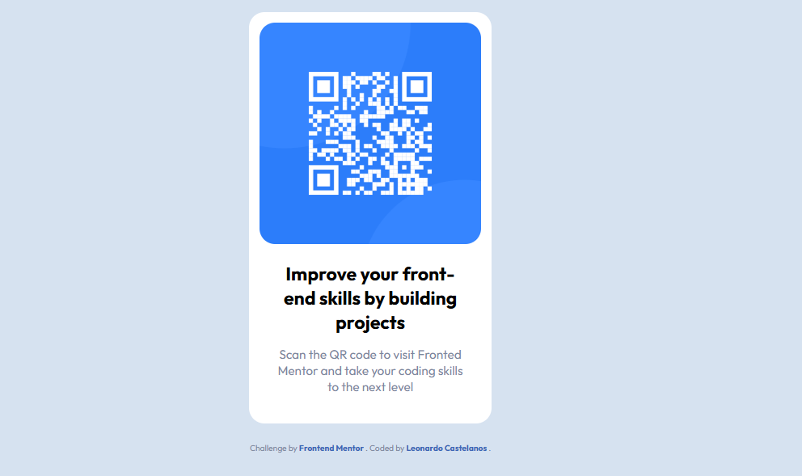
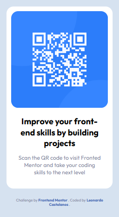

# Frontend Mentor - QR code component solution

This is a solution to the [QR code component challenge on Frontend Mentor](https://www.frontendmentor.io/challenges/qr-code-component-iux_sIO_H). Frontend Mentor challenges help you improve your coding skills by building realistic projects. 

## Table of contents

- [Overview](#overview)
  - [Screenshot](#screenshot)
  - [Links](#links)
- [My process](#my-process)
  - [Built with](#built-with)
  - [Continued development](#continued-development)
- [Author](#author)

## Overview

This is a small QR code component built as part of my frontend development practice. I recreated the provided design using HTML and CSS, focusing on responsive design, semantic markup, Flexbox, and clean code organization.

The project also gave me an opportunity to practice Git and GitHub workflows by organizing the development process into separate commits.

### Screenshot

### Links

- Solution URL: [Add solution URL here](https://github.com/CasteLeonardo/qr-code-component-main.git)
- Live Site URL: [Add live site URL here](https://qr-component-llano.netlify.app/)

## My process

### Built with

started by building the basic HTML structure using semantic HTML5 elements. I created the QR code card with a clear structure for the image, title, description, and footer.

After setting up the markup, I focused on the CSS styling, using Flexbox to align and center the card and applying responsive sizing so the component works well across different screen sizes.

I also organized the stylesheet into clear sections and used BEM naming conventions for the component classes. Finally, I added a footer with links to my GitHub profile and the original design source.

- Semantic HTML5 markup
- CSS custom properties
- Flexbox
- Mobile-first workflow
- Responsive design
- BEM naming convention

### Continued development

I would like to revisit this project in the future and rebuild the styling using Sass (SCSS) instead of plain CSS.

This would give me an opportunity to practice Sass features such as variables, nesting, partials, mixins, and a more organized CSS architecture while keeping the same overall design and functionality.

## Author

- Website - [Leonardo Castellanos Portafolio](https://llanoportafolio.netlify.app/)
- Frontend Mentor - [@CasteLeonardo](https://www.frontendmentor.io/profile/CasteLeonardo)
- Github - [@CasteLeonardo](https://github.com/CasteLeonardo)
